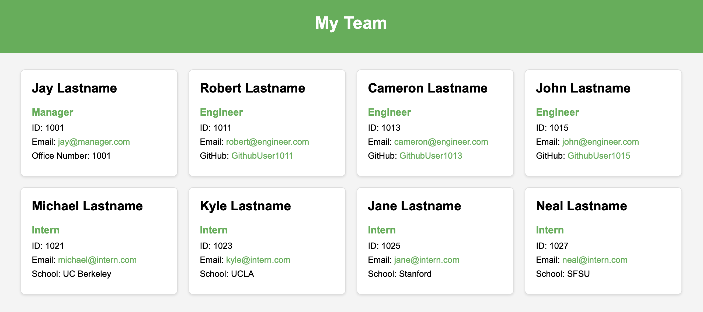

# team-profile-generator

This project is a command-line application that generates a dynamic HTML webpage to display a software engineering team's profiles, including their emails and GitHub profiles, based on user input collected through Inquirer. The application ensures maintainable code with unit tests using Jest.

### Features
- Command-line application for generating an HTML webpage to display team profiles
- Collects user input for team manager, engineers, and interns using Inquirer
- Generates a nicely formatted HTML file displaying team members' basic info, including emails and GitHub profiles
- Ensures code maintainability through unit tests with Jest

### Prerequisites / Installation
1. Clone the repository to your local machine.
2. Navigate to the project directory.
3. Install the necessary dependencies using 'npm install'

### Usage
1. Run the application by executing node index.js in the terminal.
2. Follow the prompts to enter the team manager's details, and then add engineers and interns as needed.
3. Once all team members have been added, the application will generate an HTML file in the dist folder.

## Credits / Contact
This application was made by Cameron Bushehry

  
  